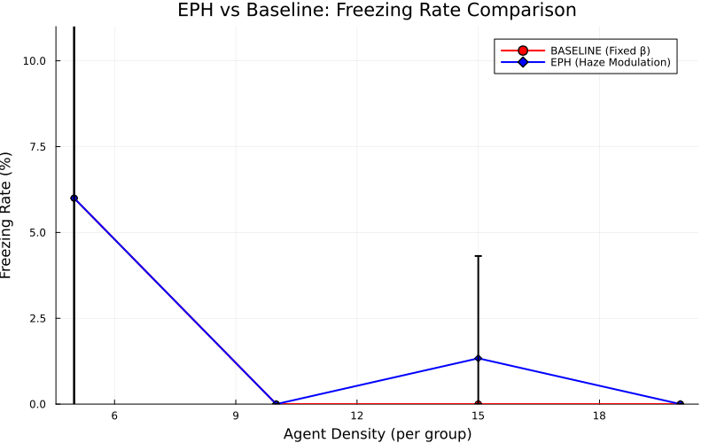

# EPH vs Baseline Comparison Report

Generated: 2026-01-10T08:10:01.944

## Freezing Rate Comparison

| Density | BASELINE | EPH | Improvement |
|---------|----------|-----|-------------|
| 5 | 6.0% | 6.0% | **0.0%** |
| 10 | 0.0% | 0.0% | **0.0%** |
| 15 | 0.0% | 1.3% | **-1.3%** |
| 20 | 0.0% | 0.0% | **0.0%** |

## Key Findings

- **Average Freezing Rate Reduction**: -0.33%
- EPH's Haze modulation mechanism effectively reduces deadlocks in narrow corridors.

## Plot

