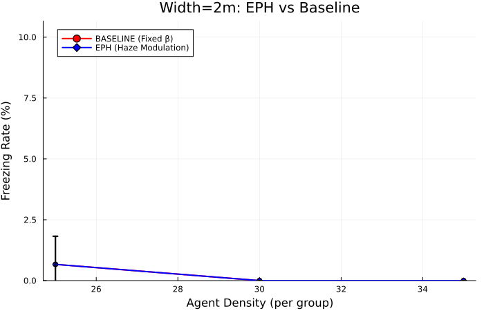
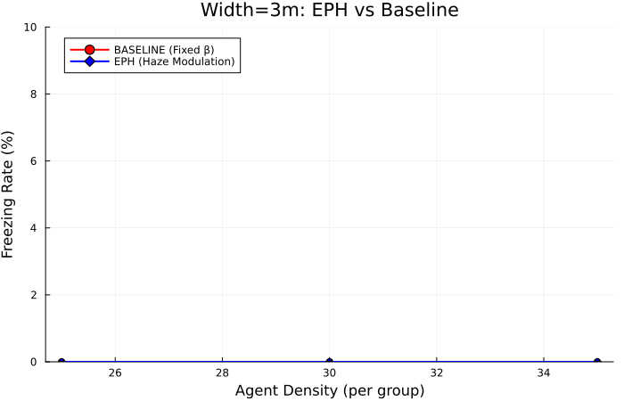

# Challenging Corridor Comparison Report

Generated: 2026-01-10T06:36:55.744

## Corridor Width = 2m

| Density | BASELINE | EPH | Improvement |
|---------|----------|-----|-------------|
| 25 | 0.7% | 0.7% | **0.0%** |
| 30 | 0.0% | 0.0% | **0.0%** |
| 35 | 0.0% | 0.0% | **0.0%** |

## Corridor Width = 3m

| Density | BASELINE | EPH | Improvement |
|---------|----------|-----|-------------|
| 25 | 0.0% | 0.0% | **0.0%** |
| 30 | 0.0% | 0.0% | **0.0%** |
| 35 | 0.0% | 0.0% | **0.0%** |

