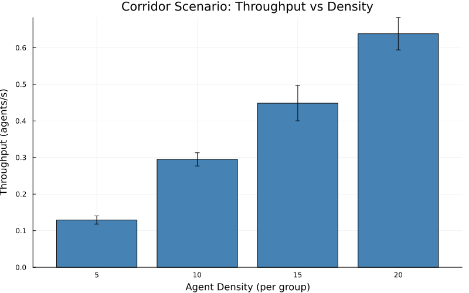

# Corridor Throughput Analysis Report

Generated: 2026-01-09T19:41:43.361

## Summary

| Density | N Agents | Mean Crossings | Mean Throughput (agents/s) |
|---------|----------|----------------|---------------------------|
| 5 | 10 | 6.4 | 0.129 |
| 10 | 20 | 14.6 | 0.295 |
| 15 | 30 | 22.2 | 0.448 |
| 20 | 40 | 31.6 | 0.638 |

## Observations

- **Crossing Line**: x = 50.0 (corridor center)
- **Simulation Time**: 49.5s per run

## Plot

